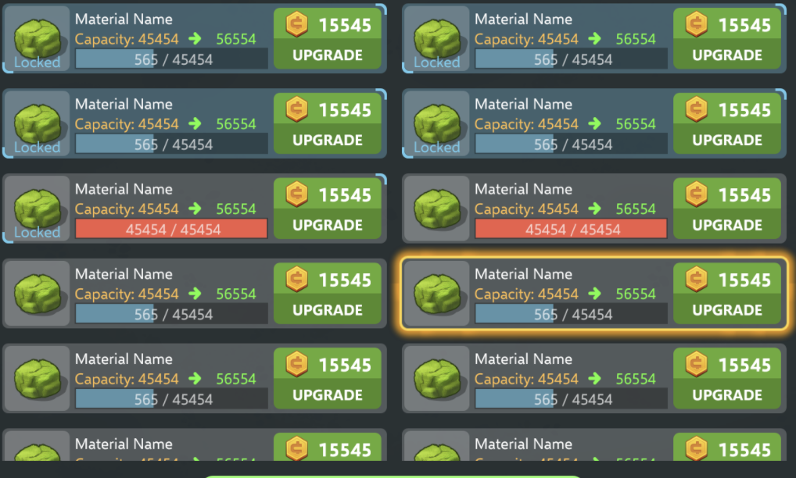

# Task

In this task we will be implementing the following design, where we are displaying properties of materials.

----

## Objectives

- Create a dynamic layout that responds to data changes
- Showcase clean code, and scene2d knowledge
- Handle data in an isolated model/view 
- Design objects that contain/represent the data for these widgets

## Specification

The layout shown in the image above, shows a list of materials and their properties. This list can be considered
infinite, with N unique materials.

We want to display these widgets in a Table, that should be wrapped by a ScrollPane. The layout should be dynamic in width,
so that the widgets can slightly expand if their parent has its width increased in X axis.

### Data

Design and think about the properties of each material and design structures that contain this data that these widgets will be
updating using.

Properties include:
- Some unique identifier for the material
- Level of capacity unlock 0-10
- Capacity at current level
- Upgrade Cost (A function of Capacity, upgradeCost = (currentLevel + 1) * 5 + 231)
- Current Amount of the material
- Name
- Locked - If the material is locked

These data objects, however you decide how to implement should be separated from UI. UI is a representation of data,
and this data does not care about UI at all, it exists with/without UI.

Expect data to change, and for widgets to update themselves when this happens. 
e.g. We change the current amount of the material, we need a clean way for the widget to be able to update from this data

### Additional Design features

- There is a lock state, this should be shown dependent on the lock state
- We also would like to be able to select each material widget, and highlight as also shown
- Progress for capacity, should change colour when we are at capacity for that material
    
    
### Additional notes

Assets are not